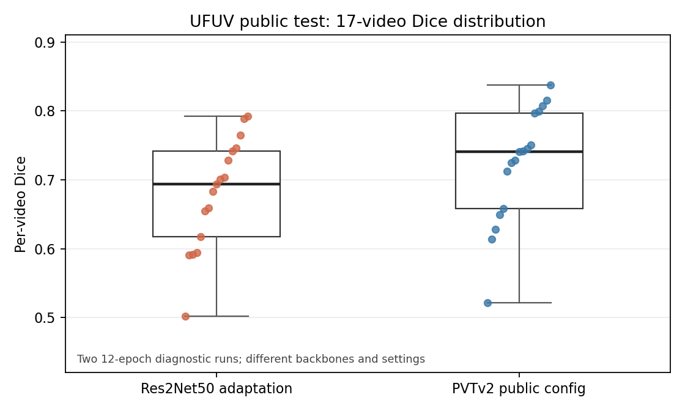
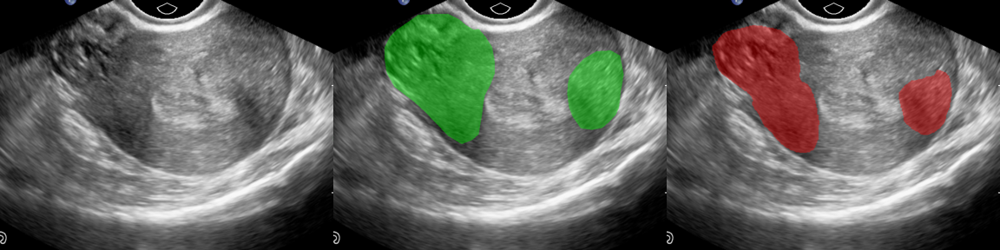
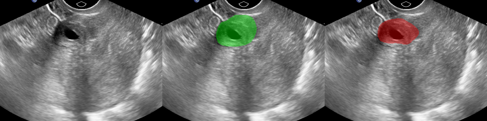

# UFUV Ultrasound Baselines

*2026-10-02 · Public UFUV release*

## Question

What do the image-based SAM3 models and a video-based LGRNet run produce on the released UFUV split?

## Setup

UFUV contains 100 videos with 50 frames each. The image-model development split used 73 training, 10 validation, and 17 public test videos. The LGRNet diagnostic runs used the released 83/17 split. These are separate run settings; the scores below are a record of each run, not a matched model comparison.

## Scores

| Run | Reported UFUV Dice | Setting |
|---|---:|---|
| SAM3-LoRA | about 0.7143 | Image-based baseline |
| MedSAM3-initialized LoRA | 0.7269 | Image-based run |
| MedSAM3 initialization + augmentation | 0.7230 | Image-based run with augmentation |
| LGRNet, released PVTv2 config | 0.721988 | 12-epoch diagnostic; frame-mean Dice |
| LGRNet, Res2Net50 adaptation | 0.679667 | 12-epoch diagnostic; frame-mean Dice; model shown below |

Additional metrics for the two LGRNet runs:

| Run | Frame-mean Dice | IoU | Sensitivity | S-measure | MAE |
|---|---:|---:|---:|---:|---:|
| PVTv2 public config | 0.721988 | 0.591211 | 0.697797 | 0.755287 | 0.069637 |
| Res2Net50 adaptation | 0.679667 | 0.541273 | 0.651422 | 0.727665 | 0.078040 |

The paper describes a Res2Net50 backbone, while the released fibroid config uses PVTv2. Neither diagnostic run reproduces the exact paper setup.

### Variation across videos

These are **per-video** Dice values across the 17 public test videos. They use a different averaging unit from the frame-mean Dice above.

| LGRNet run | Videos | Min | Median | Max |
|---|---:|---:|---:|---:|
| PVTv2 public config | 17 | 0.5217 | 0.7404 | 0.8379 |
| Res2Net50 adaptation | 17 | 0.5020 | 0.6938 | 0.7925 |

### Example predictions

Both panels use public UFUV test frames. Left to right: frame, ground truth (green), and the Res2Net50 adaptation's prediction (red). They illustrate two different outcomes; they do not summarize all 850 test frames.

See [figure provenance](../figures/README.md).

## Next

A test of temporal context needs matched video IDs, input frames, training budget, checkpoint rule, and metric. The current runs do not isolate that effect.
